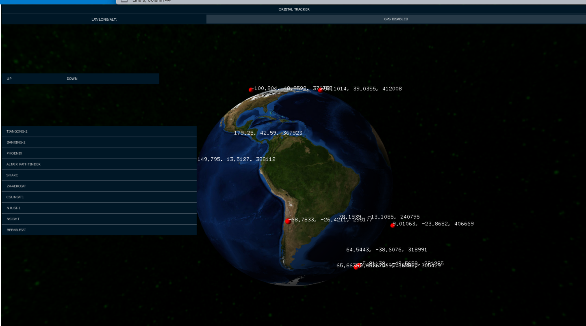
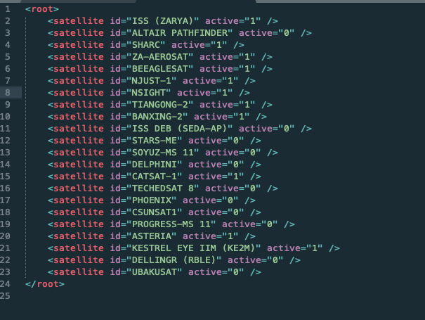

# Android Orbital Tracker

Orbital Tracker is an [in development] c++ android application that tracks orbital objects, like satellites, debris and stations in real time.
Another feature is the accurate sun light cast over earth, including variation from earth's inclination over year-time.

### Version
0.0.2

### Build on
* For Android: [Android Studio] - Android NDK r10e + Gradle Experimental (for auto-complete support)
* [openFrameworks] - C++ toolkit
* [ofxSatellite] as core addon by bakercp (thanks!) https://github.com/bakercp/ofxSatellite

### images

* add satellites with their unique object identifier

